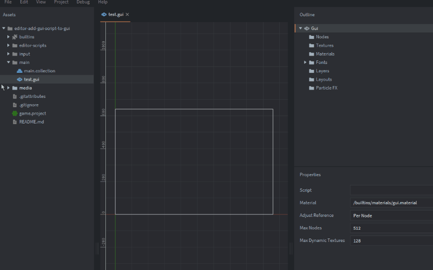

# Collection of Defold Editor Scripts and UI

## add-gui-script-for-gui

It creates a `.gui_script` file and links it to this `.gui` component immediately (to `Script` property).

1. Right click on any `.gui` file in `Assets`.
2. Select `Add GUI Script`.

## create-gui-script-for-gui

It creates both `.gui` component and `.gui_script` files binded together **and** puts a game object with gui component with this gui directly in collection. It also has a UI popup, where you can type a name!

1. Right click on `root` in your collection's `Outline` pane.
2. Select `Add GUI to collection`.
3. Type in a name and click `Enter`.
4. Click `Create`.

## Installation
You can use the these editor scripts in your own project by adding this project as a [Defold library dependency](https://www.defold.com/manuals/libraries/). Open your `game.project` file and in the dependencies field under project add:  
`https://github.com/paweljarosz/editor-scripts-ui-collection/archive/master.zip` or particular version. You can also just copy and paste needed scripts directly to your project directory.

## License

This project is licensed under the MIT License.

Copyright 2024 Paweł Jarosz

Permission is hereby granted, free of charge, to any person obtaining a copy of this software and associated documentation files (the “Software”), to deal in the Software without restriction, including without limitation the rights to use, copy, modify, merge, publish, distribute, sublicense, and/or sell copies of the Software, and to permit persons to whom the Software is furnished to do so, subject to the following conditions:

The above copyright notice and this permission notice shall be included in all copies or substantial portions of the Software.

THE SOFTWARE IS PROVIDED “AS IS”, WITHOUT WARRANTY OF ANY KIND, EXPRESS OR IMPLIED, INCLUDING BUT NOT LIMITED TO THE WARRANTIES OF MERCHANTABILITY, FITNESS FOR A PARTICULAR PURPOSE AND NONINFRINGEMENT. IN NO EVENT SHALL THE AUTHORS OR COPYRIGHT HOLDERS BE LIABLE FOR ANY CLAIM, DAMAGES OR OTHER LIABILITY, WHETHER IN AN ACTION OF CONTRACT, TORT OR OTHERWISE, ARISING FROM, OUT OF OR IN CONNECTION WITH THE SOFTWARE OR THE USE OR OTHER DEALINGS IN THE SOFTWARE.

## Issues and suggestions

If you have any issues, questions or suggestions please [create an issue](https://github.com/paweljarosz/editor-scripts-ui-collection/issues).

## ❤️ Support ❤️

If you appreciate what I'm doing, please consider supporting me!

  