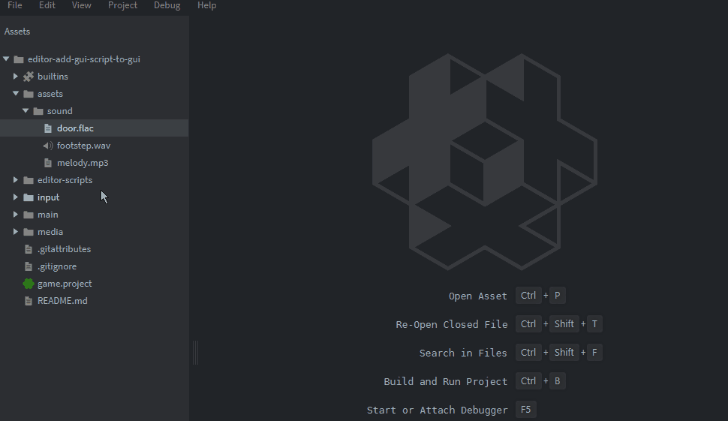
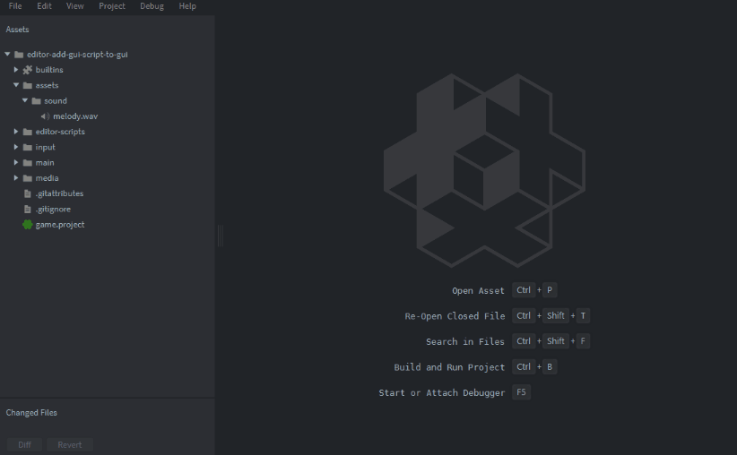
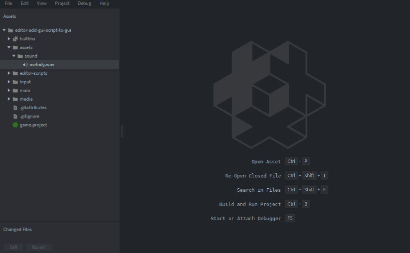
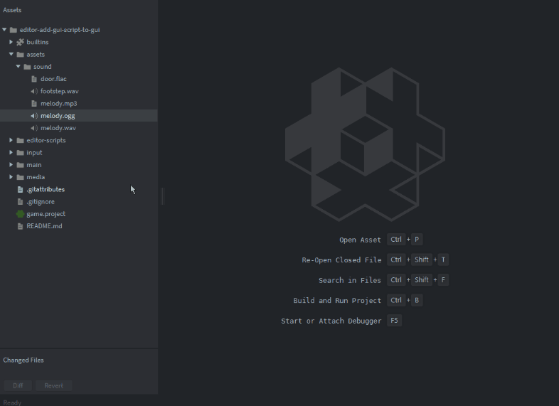

# Collection of Defold Editor Scripts and UI

Useful Editor Scripts with custom UI for Defold.

> Note!
Curent scripts run and are tested on Windows. OS-independent scripts (e.g. creating components) should work on all platforms. I might do Linux too in the future. MacOS PRs are welcomed.

# GUI 🪟

## gui-add-script 📜

It creates a `.gui_script` file and links it to this `.gui` component immediately (to `Script` property).

1. Right click on any `.gui` file in `Assets`.
2. Select `Add GUI Script`.

## gui-add-to-collection 🪟

It creates both `.gui` component and `.gui_script` files binded together **and** puts a game object with gui component with this gui directly in collection. It also has a UI popup, where you can type a name!

1. Right click on `root` in your collection's `Outline` pane.
2. Select `Add GUI to collection`.
3. Type in a name and click `Enter`.
4. Click `Create`.

---

# Sound 🔊

> Note! Read FFmpeg dependency section below before first use.

##  sound-convert ♻️

It allows you to convert sound file(s) (`.mp3`, `.wav.`, `.ogg`, `.flac` or `.aac`.) to one of Defold compatible sound files (`.wav`, `.ogg`).

1. Right click on any sound file (or selected multiple sound files).
2. Select `Convert Sound`.
3. Select output file format from a dropdown list (`OGG` or `WAV`)
4. Click `Convert`

For each source file, it creates a file with the same name as a source file, in the same location, but with `.wav` / `.ogg` extension. File is at 44100 Hz.

## sound-play ▶️

It allows you to "prehear" given sound. Plays `.mp3`, `.wav`, `.ogg`, `.flac` or `.aac`. It plays the sound once either until end of file or until the moment when the popup UI is closed.

1. Right click on any sound file.
2. Select `Play`

P.S.
There are two versions of this script actually, but second is commented out:
1. **Play**
when you run it first time your OS might go crazy - it plays in background, but because of this, it requires your explicit permissions, e.g. Windows asks for permission to run from Unknown Publisher.
You can uncheck this bottom checkbox saying `"Always ask before opening this file"` and it should never prompt again.
Your antivirus might also block or quantine it - you can make an exception for it.
opens terminal window additionally. You can then either close this window or closing the UI popup in Defold will also close it.
2. **Play in Terminal**  
because of issues above, I leave there another version that is "safe" - plays in separate Terminal Window. If you like it more, you can use this (just comment out Play in Terminal command in the script).

I would love if someone could figure out and propose better solutions :D 

## sound-cut ✂️

It allows you to cut a subtrack out of the source track (`.mp3`, `.wav`, `.ogg`, `.flac` or `.aac`). It needs `start` and `end` timestamps and creates one subtrack saved into file of same format, where X is start (in seconds from original sound beginning) and Y is stop timestamp (in s). 
`end` has to be larger than `start`. 
`end` can't be larger than source sound duration (provided as information in popup)

1. Right click on any sound file.
2. Select `Cut Subtrack`.
3. Set `Start Time` and `End Time` timestamps (in seconds). Eventually change output Subtrack file name.
4. *Experimental.* You can eventually "prehear" the cut subtrack by clicking `Play Subtrack` button. Close the popup to stop it playing.
5. Click `Extract` to extract the cut subtrack to a file.

P.S. It checks for input validity and also asks if you want to overwrite if file with same name exists. Also, make sure you click "somewhere" after editing inputs - value is changed "on release" not on input changes, so before you click "Play Subtrack", ensure the changed values are "in".

P.P.S. I know, it would be great to have a visual waveform on a timeline with start and end markers for it to be convenient, but anyway - it simplifies this process a lot and you don't need to explicitly use external programs ;)

## sound-component 🔊

It allows you to create a Defold Sound Component out of a compatible sound file (`.wav` or `.ogg`).

1. Right click on a sound file.
2. Select `Create Sound Component`.
3. Eventually change default properties.
5. Click `Create`.

---

## Installation - FFmpeg dependency

Currently, there is no possibility to do anything with sounds in Editor Scripts, afaik. So I used powerful `execute` and utilised FFmpeg.

In order to use them, you have to install FFmpeg then. Download executables from:

https://www.ffmpeg.org/download.html

And add installation localization to PATH (windows).

On Windows you can also:
1. Open Windows Powershell
2. `winget install ffmpeg`
3. `Y` to confirm
4. Check installation path: `where ffmpeg`
( should give e.g. --> `C:\ffmpeg\bin\ffmpeg.exe`)

On Linux you can (though scripts are Windows only - they need modifications to run on Linux):
1. Open terminal
2. `sudo apt install ffmpeg` (or `sudo snap install ffmpeg`)
3. `Y` to confirm
4. Check installation path: `which -a ffmpeg`
(should give e.g. --> `/usr/bin/ffmpeg` or `/bin/ffmpeg`)

If your path is different, please modify it in scripts (perhaps there should be a script to install ffmpeg and add its path here, but for now.. heh :sweat_smile:) in the common `ffmpeg_helper.lua` module:

    -- Adjust the paths if needed
    local FFMPEG_PATH = "C:/ffmpeg/bin/ffmpeg.exe"
    local FFPLAY_PATH = "C:/ffmpeg/bin/ffplay.exe"
    local FFPROBE_PATH = "C:/ffmpeg/bin/ffprobe.exe"

### FFplay and FFprobe dependency

Additionally, sound-play Editor Script utilizes `ffplay` and sound-cut utilizes `ffprobe`.
Ensure that `ffplay` and `ffprobe` comes with your installation. They might be in `.../ffmpeg/bin/`. 
Check `ffplay -version` and ``ffprobe -version` in terminal. If not, [download them](https://github.com/BtbN/FFmpeg-Builds/releases) and copy there.

---

## Installation - as Defold dependency 
You can use the these editor scripts in your own project by adding this project as a [Defold library dependency](https://www.defold.com/manuals/libraries/). Open your `game.project` file and in the dependencies field under project add:  
`https://github.com/paweljarosz/editor-scripts-ui-collection/archive/master.zip` or particular version. You can also just copy and paste needed scripts directly to your project directory.

---

## License

This project is licensed under the MIT License.

Copyright 2024 Paweł Jarosz

Permission is hereby granted, free of charge, to any person obtaining a copy of this software and associated documentation files (the “Software”), to deal in the Software without restriction, including without limitation the rights to use, copy, modify, merge, publish, distribute, sublicense, and/or sell copies of the Software, and to permit persons to whom the Software is furnished to do so, subject to the following conditions:

The above copyright notice and this permission notice shall be included in all copies or substantial portions of the Software.

THE SOFTWARE IS PROVIDED “AS IS”, WITHOUT WARRANTY OF ANY KIND, EXPRESS OR IMPLIED, INCLUDING BUT NOT LIMITED TO THE WARRANTIES OF MERCHANTABILITY, FITNESS FOR A PARTICULAR PURPOSE AND NONINFRINGEMENT. IN NO EVENT SHALL THE AUTHORS OR COPYRIGHT HOLDERS BE LIABLE FOR ANY CLAIM, DAMAGES OR OTHER LIABILITY, WHETHER IN AN ACTION OF CONTRACT, TORT OR OTHERWISE, ARISING FROM, OUT OF OR IN CONNECTION WITH THE SOFTWARE OR THE USE OR OTHER DEALINGS IN THE SOFTWARE.

## Issues and suggestions

If you have any issues, questions or suggestions please [create an issue](https://github.com/paweljarosz/editor-scripts-ui-collection/issues).

## ❤️ Support ❤️

If you appreciate what I'm doing, please consider supporting me!

  